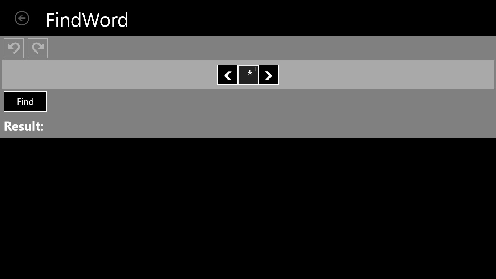
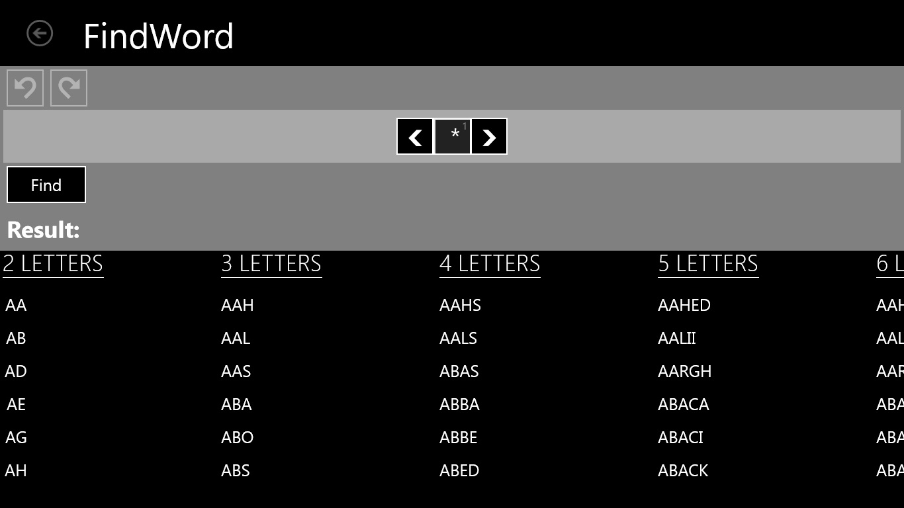
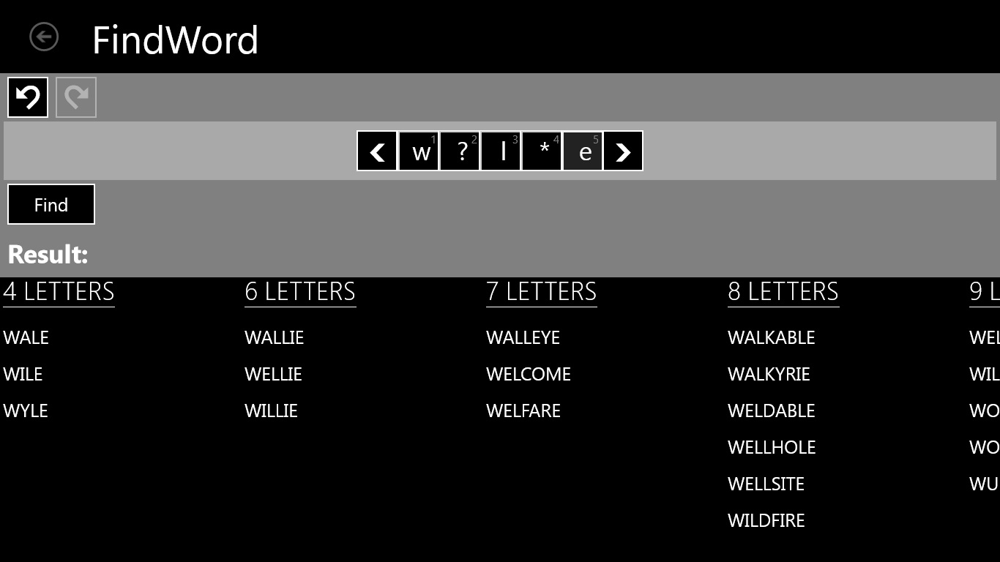
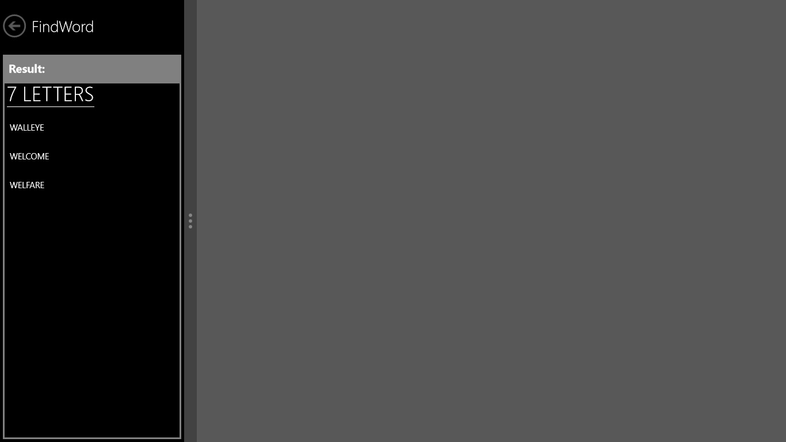
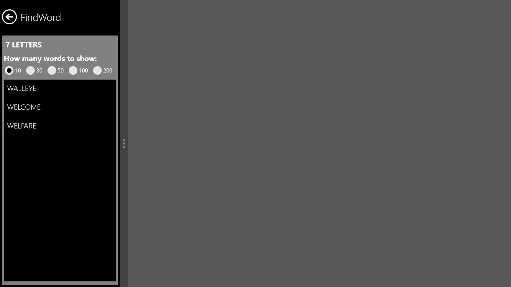
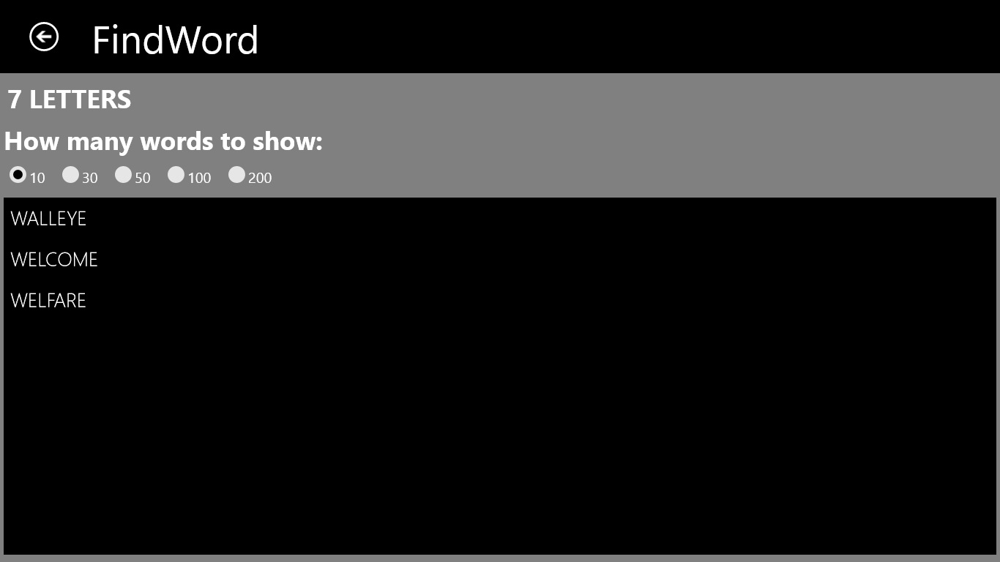
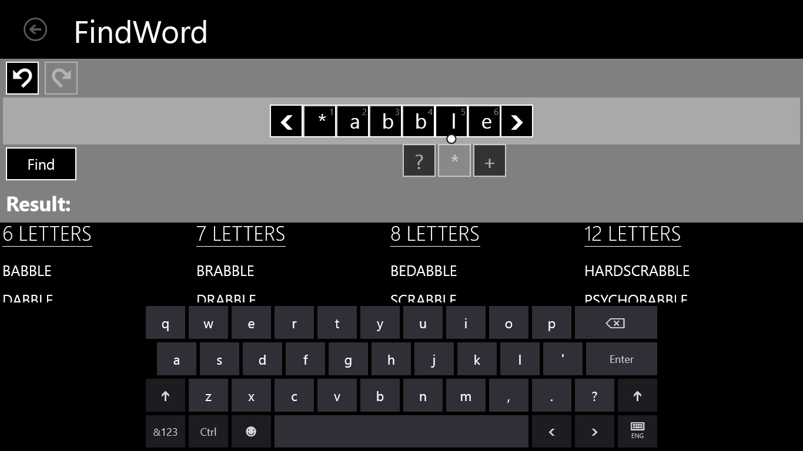
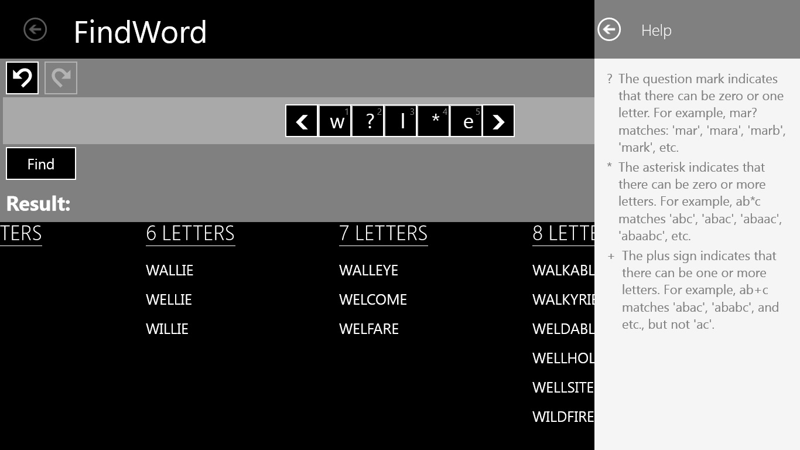

# FindWord WinRT application for Windows Store

Do You like to play in scrabble, or guess crosswods, or maybe you prefer searching all words in “find words” applications? 
Then the “FindWord” application helps You to find an appropriate word. 
The “FindWord” application provides You with a possibility not just to find an searching word, but also to refresh one’s memory, using the easiest and quickest way.

Extended splash

The application is started with the page, which contains a menu panel, a panel for symbols insertion, “Find” button and Result’s panel.

Result’s panel shows just six random found words, which are grouped by number of letters. Headers of columns are hyperlinks, which can be opened by tapped on them. For example you can tap by ‘2 LETTERS’ hyperlink and that action moved you to a page with all other found possible words of chosen hyperlink. 

Menu panel contains UNDO button and REDO button. If You would like to cancel a current operation, everything what you should do just tap UNDO button. In a case if You would like to come back on your canceled operation - You tap REDO button.
Panel for symbols insertion () contains two horizontally movable arrows and textboxes, which are added, when arrows move away, or removed, when arrows draw near.

Snapped view of the start page

After that as you tapped ‘7 LETTERS’ hyperlink (look at the 5 screen), you go to the next page, which displays found words of selected word length.

Filled view

When you tap any textbox, you can see the popup with 3 buttons, such as question symbol (‘?’), star symbol (‘*’) and plus sign (‘+’).

The FindWord application contains “Help”, which contains a descriptions and examples of using ‘?’,’*’ and ‘+’ signs.

